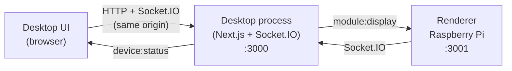

# Cubism

Smart AI holographic assistant platform built around a Raspberry Pi-powered beam splitter cube display.

Cubism is a pnpm monorepo with two runtime apps and three shared packages:

```txt
apps/
  desktop/        Next.js control panel + Socket.IO bridge (port 3000)
  renderer/       Next.js fullscreen hologram UI (port 3001)
packages/
  protocol/       Shared Socket.IO event types
  modules/        Hologram module manifests + registry
  supabase/       Supabase clients + SQL schema
```

The desktop app runs a custom Next.js server ([apps/desktop/server.ts](./apps/desktop/server.ts)) that serves the control panel UI **and** the Socket.IO bridge from the same Node process on a single port. The Raspberry Pi renderer connects back to that port over the LAN.

See [development_plan.md](./development_plan.md) for the original specification.

## Prerequisites

- Node.js 20+ (developed against Node 22)
- pnpm 9+ (`npm install -g pnpm`)

## Getting started

```bash
pnpm install

# Copy env templates
cp apps/desktop/.env.example  apps/desktop/.env.local
cp apps/renderer/.env.example apps/renderer/.env.local

# Start everything in parallel
pnpm dev
```

Or run apps individually:

```bash
pnpm dev:desktop   # Desktop UI + Socket.IO on :3000
pnpm dev:renderer  # Hologram renderer on :3001
```

Visit <http://localhost:3000> to verify the bridge is up (or hit `http://localhost:3000/api/health` for a JSON health probe).

## MVP demo flow

1. Open <http://localhost:3000> (desktop).
2. The renderer (running at <http://localhost:3001>) registers as `pi-holo-001`.
3. The desktop shows the device as **online**.
4. Pick a clock format / toggle seconds and click **Display Clock on Hologram**.
5. The renderer animates the holographic Clock Module.

## Scripts

| Command            | Description                                       |
| ------------------ | ------------------------------------------------- |
| `pnpm dev`         | Run desktop + renderer concurrently               |
| `pnpm dev:desktop` | Custom Next.js server (UI + Socket.IO) via `tsx`  |
| `pnpm dev:renderer`| Renderer Next.js dev server                       |
| `pnpm build`       | Build every workspace package                     |
| `pnpm typecheck`   | Type-check every workspace package                |
| `pnpm lint`        | Lint every workspace package                      |

## Raspberry Pi kiosk

On the Pi, build and serve the renderer, then launch Chromium in kiosk mode:

```bash
pnpm --filter renderer build
pnpm --filter renderer start

chromium-browser \
  --kiosk \
  --disable-infobars \
  --noerrdialogs \
  http://localhost:3001
```

In `apps/renderer/.env.local` on the Pi, set `NEXT_PUBLIC_SOCKET_URL` to the LAN address of the machine running the desktop app — e.g. `http://192.168.1.42:3000`. Open port 3000 in the desktop machine's firewall.

A systemd service can wrap both processes for auto-start on boot.

## Architecture



Shared `@cubism/protocol` types make every Socket.IO event fully typed across desktop and renderer (modules ship opaque `unknown` configs over the wire and are validated against each module's Zod schema on receive). New hologram modules are added by creating one folder under `packages/modules/src/<id>/` containing the manifest, Zod schema, `Controls` component, and `Renderer` component, then registering it in `packages/modules/src/index.ts`. Both apps consume the registry automatically — no app-side edits required.

Supabase is wired up but auth stays mocked for the MVP via `NEXT_PUBLIC_DEMO_USER_ID`.

### Environment variables

`apps/desktop/.env.local`:

| Variable                       | Purpose                                                                |
| ------------------------------ | ---------------------------------------------------------------------- |
| `PORT`                         | Port the combined Next.js + Socket.IO process binds to (default 3000). |
| `ALLOWED_ORIGINS`              | Comma-separated CORS allow-list. Empty = reflect any origin.           |
| `NEXT_PUBLIC_SOCKET_URL`       | Optional override; defaults to the page origin.                        |
| `NEXT_PUBLIC_DEMO_USER_ID`     | Mock user id used by the control panel.                                |
| `NEXT_PUBLIC_DEMO_DEVICE_ID`   | Device id the desktop sends commands to.                               |
| `NEXT_PUBLIC_SUPABASE_*`       | Optional Supabase credentials.                                         |

`apps/renderer/.env.local`:

| Variable                  | Purpose                                                  |
| ------------------------- | -------------------------------------------------------- |
| `NEXT_PUBLIC_SOCKET_URL`  | URL of the desktop process (e.g. `http://laptop:3000`).  |
| `NEXT_PUBLIC_DEVICE_ID`   | Stable id for this hologram device.                      |

## AI Assistant setup

The AI Assistant module turns the hologram into a push-to-talk voice agent: the Pi captures audio from a USB mic, the desktop process transcribes it via a local Whisper service, pipes the transcript through LM Studio for a response, then plays the response on the desktop's speakers while showing it on the hologram.

Three pieces need to be running on the desktop machine alongside `pnpm dev`:

1. **LM Studio** with at least one chat model loaded. Enable **Local Server** under **Developer → Local Server** so its OpenAI-compatible API binds to `http://127.0.0.1:1234`.
2. **Whisper STT** — any OpenAI-compatible `/v1/audio/transcriptions` server. The easiest is `faster-whisper-server` via Docker:

   ```bash
   docker run --rm -p 8000:8000 \
     -v ~/.cache/huggingface:/root/.cache/huggingface \
     --name faster-whisper-server \
     fedirz/faster-whisper-server:latest-cpu
   ```

   (Drop `-cpu` for GPU images.) First request downloads the model; subsequent calls are fast.
3. A USB mic plugged into the Pi. The renderer prompts for mic permission the first time you press the center key — accept it, and it remembers for future sessions.

Then open the desktop control panel, pick **AI Assistant** from Modules, hit **Test** on both the LM Studio and Whisper fields, and press the center macropad key (or `Space` / `Enter` on the Pi's keyboard) to talk. Press it again to stop and send.

The defaults in `apps/desktop/.env.example` (`CUBISM_LMSTUDIO_URL`, `CUBISM_WHISPER_URL`, `CUBISM_WHISPER_MODEL`, `CUBISM_AI_SYSTEM_PROMPT`, `CUBISM_AI_MAX_TURNS`) all point at the URLs above and can be overridden at runtime from the Controls panel.
